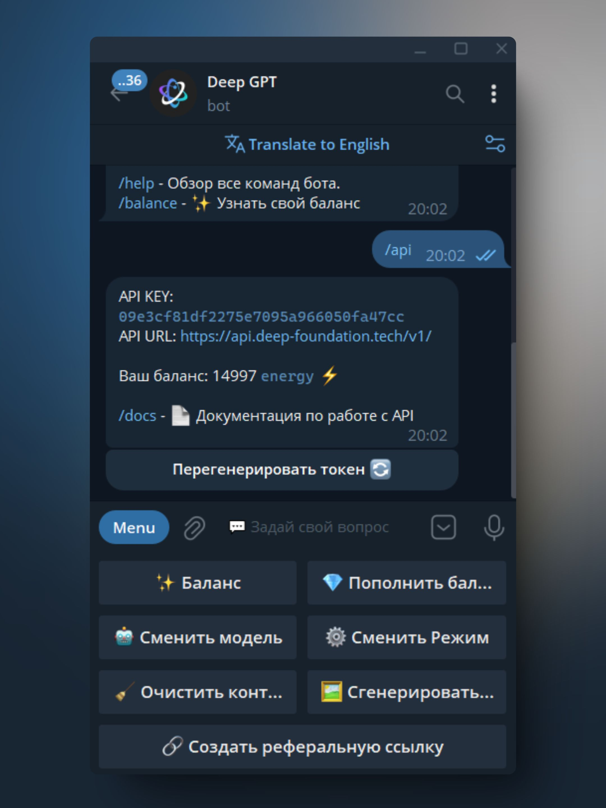

# API Documentation `Deep.GPT`

## Getting the API key

The key must be obtained in the bot https://t.me/DeepGPTBot , call the `/api` command



## Using the API in `JavaScript`

### Installation

```commandline
npm install openai
```

### Usage

```js
import OpenAI from 'openai';

const client = new OpenAI({
  // You can get a token in the bot https://t.me/DeepGPTBot calling the `/api` command
  apiKey: "YOUR KEY", 
  baseURL: "https://api.deep-foundation.tech/v1/"
});

async function main() {
  const chatCompletion = await openai.chat.completions.create({
    messages: [{ role: 'user', content: 'Say this is a test' }],
    model: 'gpt-3.5-turbo',
  });
}

main();
```

### Streaming responses

```js
import OpenAI from 'openai';

const client = new OpenAI();

async function main() {
  const stream = await openai.chat.completions.create({
    model: 'gpt-3.5-turbo',
    messages: [{ role: 'user', content: 'Say this is a test' }],
    stream: true,
  });
  
  let result = "";
  
  for await (const chunk of stream) {
    result += chunk.choices[0]?.delta?.content || '';
    console.log(result);
  }
}

main();
```

## Using the API in `Python`

### Installation

```commandline
pip install openai
```

### Usage

```python
from openai import OpenAI

openai = OpenAI(
    # You can get a token in the bot https://t.me/DeepGPTBot calling the `/api` command
    api_key="YOUR KEY",
    base_url="https://api.deep-foundation.tech/v1/",
)

chat_completion = openai.chat.completions.create(
    model="gpt-3.5-turbo",
    messages=[{"role": "user", "content": 'Say this is a test'}],
)

print(chat_completion.choices[0].message.content)
```

### Streaming responses


```python
from openai import OpenAI

openai = OpenAI(
    # You can get a token in the bot https://t.me/DeepGPTBot calling the `/api` command
    api_key="YOUR KEY",
    base_url="https://api.deep-foundation.tech/v1/",
)

stream = openai.chat.completions.create(
    model="gpt-3.5-turbo",
    messages=[{"role": "user", "content": 'Say this is a test'}],
    stream=True
)

for chunk in stream:
    print(chunk.choices[0].delta.content or "", end="")

```